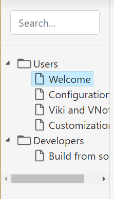

# Viki and VNote
Viki could recognize the `vx.json` index file of VNote's notebook. There are two ways to combine Viki and VNote.

- Copy one of VNote's notebook or folder to your site;
- Create a notebook inside your site.

::: alert-info

You could just copy files within `dist/` to the root of your notebook. By default, the `navigation.json` will point to `vx.json` in current directory.

:::

You need to edit `navigation.json` to add one item pointing to the `vx.json` file:

```json
{
    "navigation":
    [
        {
            "text": "Notebook",
            "target": "vnotebok/vx.json",
            "navi": true,
            "navi_index": "vnotebook/docs/welcome.md"
        }
    ]
}
```

You could specify the index page to show when user click item `Notebook` via `navi_index`. If not specified, VNote will only show a file tree on the left side for navigation of the notebook.



- Suffix will be omitted by default;
- Viki provides a simple search against the file name;
