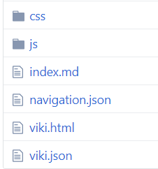

# 简单开始
## 准备空间托管Viki
首先，你得准备一个空间来托管你的网站。任何能够托管静态内容的服务都可以。

下面是一些例子。

### Github
[GitHub Pages](https://pages.github.com/) 是一个很好的托管静态内容的服务。

::: alert-info

你需要在项目根目录下添加一个`.nojekyll`文件，以关闭Jekyll服务。否则，任何以下划线开始命名的文件和目录都会被过滤掉。具体参考 [GitHub Blogs](https://blog.github.com/2009-12-29-bypassing-jekyll-on-github-pages/) 。

:::

### 本地
你可以在本地运行一个轻量级的HTTP服务器，从而可以通过本地网络分享你的内容。

有两个简单的选择：

1. `python -m SimpleHTTPServer` 命令启动一个Python的HTTP服务器；
2. `http-server` 命令启动一个node.js的HTTP服务器，具体可以参考[这里](https://www.npmjs.com/package/http-server) 。

::: alert-warning

`SimpleHTTPServer` 可能对包含中文的路径不太友好。

:::

## 获取Viki
从[GitHub Releases](https://github.com/tamlok/viki/releases)上下载Viki的相关文件。 你需要的文件都位于`dist/`目录下面。

复制所有文件到你的网站的根目录下。假设网站的地址是`http://localhost:8080`。

`index.html` 是Viki的入口。现在可以通过`http://localhost:8080/index.html`访问你的网站。缺省情况下，Viki会尝试读取`index.md`并展示其内容。

可以通过在`http://localhost:8080/index.html`之后加上`#!`以及页面的相对路径来访问某个页面。例如，`http://localhost:8080/index.html#!abc.md`可以访问文件位于根目录下的`abc.md`文件；`http://localhost:8080/index.html#!main/def.md` 可以访问文件 `main/def.md`。

一般来说，可以省略地址中的`index.html`，例如`http://localhost:8080/`就可以访问`index.md`。

`css/`和`js/`存放的是Viki的资源文件。`navigation.json`用于设置网站的导航栏。`viki.json`用于配置Viki。具体请参考[文档](docs/_vnote.json) 。

## 添加更多文件到Viki中
现在，你可以添加更多`*.md`文件到你的网站中。如果需要在导航栏展示一个页面，你需要将其添加到`navigation.json`中。

## VNote笔记本
Viki能读取VNote笔记本的索引文件。因此，你可以在你的网站中直接存放一个VNote的笔记本，Viki会自动展示其内容。具体请参考[Viki和VNote](docs/用户/Viki和VNote.md) 。
